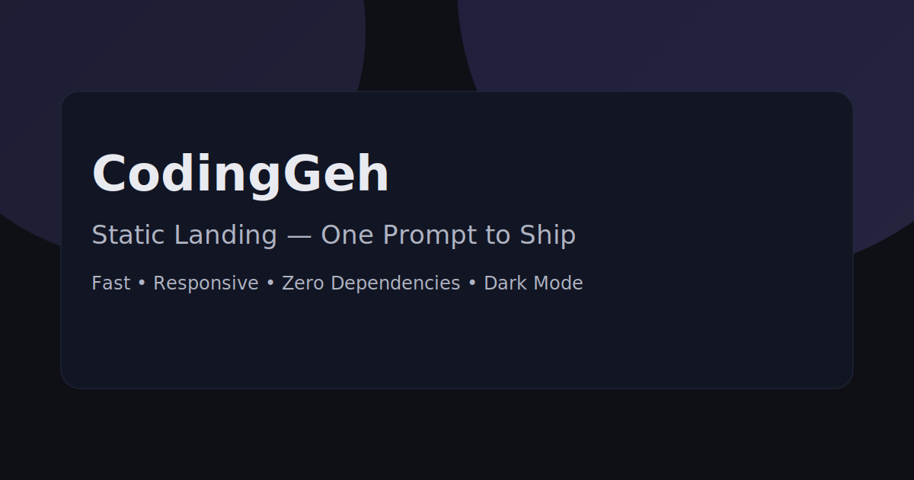

# 🌐 CodingGeh Static Landing

<div align="center">
  
  <br>
  <strong>Modern Static Website — Pure HTML, CSS, JS</strong>
  <br>
  <em>Built with ❤️ by CodingGeh</em>
</div>

## 🎬 Demo

<div align="center">
  <a href="https://coding-geh.github.io/static-landing/">
    
  </a>
  <a href="https://github.com/Coding-Geh/static-landing/stargazers">
    
  </a>
  <a href="https://github.com/Coding-Geh/static-landing/network">
    
  </a>
</div>

<div align="center">
  <a href="#about">About</a> •
  <a href="#features">Features</a> •
  <a href="#tech-stack">Tech Stack</a> •
  <a href="#architecture">Architecture</a> •
  <a href="#getting-started">Getting Started</a> •
  <a href="#deploy">Deploy</a>
</div>

---

<div align="center">
  
  
  
  
</div>

## 🎯 Project Goal & Learning Journey

This project demonstrates how far you can go with a static stack — no frameworks, no build tools — while still shipping a polished, responsive, multi-language, SEO-ready landing page suitable for GitHub Pages.

## 📋 About

This is a **DEMONSTRATION PROJECT** by [CodingGeh](https://github.com/Coding-Geh) showcasing:

- Static web development with modern UI/UX
- Internationalization without libraries (EN/ID)
- SEO best practices (Open Graph, Twitter Card, JSON-LD)
- Responsive layout and accessible navigation

## ✨ Features

- 🎯 **Zero Dependencies** — Pure HTML, CSS, JS
- 📱 **Responsive Layout** — Mobile-first grid, polished on desktop
- 🌓 **Dark Mode** — Theme toggle with persistence
- 🌐 **i18n EN/ID** — Auto-detect, URL override `?lang=en|id`, header toggle
- 🔎 **SEO Ready** — Canonical, OG/Twitter meta, JSON-LD (Organization, WebSite), `robots.txt`, `sitemap.xml`
- ♿ **Accessibility** — Skip link, focus trap, keyboard navigation, ARIA
- 🎞️ **Animations** — Orbs background, hover elevation, reveal-on-scroll

## 🛠️ Tech Stack

- HTML5
- CSS3 (custom properties, media queries)
- JavaScript (ES6+)
- GitHub Pages (static hosting)

## 🏗️ Architecture

```
static-landing/
├── index.html       # Markup + SEO + i18n hooks
├── styles.css       # Theme, layout, animations
├── script.js        # i18n, theme, nav, scrollspy, SEO hydration
├── og-image.svg     # Social preview
├── robots.txt       # Allow all, sitemap link
└── sitemap.xml      # Sitemap anchors
```

## 🚀 Getting Started

```bash
# Serve locally
python3 -m http.server 8080 --directory static-landing
# Open http://localhost:8080
```

## 🌍 Internationalization

- Default follows device language (EN/ID)
- Force language via `?lang=en` or `?lang=id`
- Edit dictionary in `script.js`

## 🔎 SEO

- Canonical, og:url, and hreflang → `https://coding-geh.github.io/static-landing/`
- JSON-LD hydrated at runtime to match final domain
- Update `sitemap.xml` if anchors change

## 🚢 Deploy (GitHub Pages)

```bash
git init
git remote add origin https://github.com/Coding-Geh/static-landing.git
git add .
git commit -m "feat: initial static landing (SEO + i18n + dark mode)"
git branch -M main
git push -u origin main
```

Then: GitHub → Settings → Pages → Source: Deploy from a branch → Branch: `main` → Folder: `/root`.

## 📄 License

MIT © CodingGeh

---

<div align="center">
  <strong>Made with ❤️ by CodingGeh</strong>
  <br>
  <em>Building the future, one site at a time</em>
</div>


