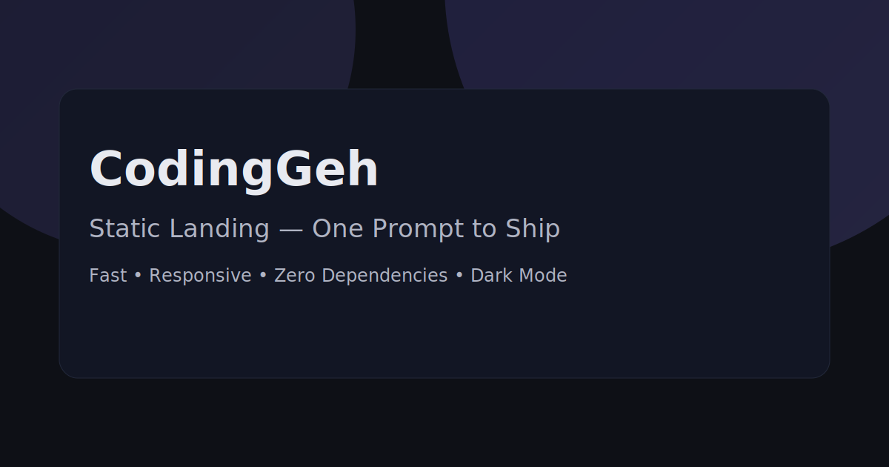

# 🌐 CodingGeh Static Landing

<div align="center">
  
  <br>
  <strong>Website Statis Modern — HTML, CSS, JS Murni</strong>
  <br>
  <em>Dibuat dengan ❤️ oleh CodingGeh</em>
</div>

## 🎬 Demo

<div align="center">
  <a href="https://coding-geh.github.io/static-landing/">
    
  </a>
  <a href="https://github.com/Coding-Geh/static-landing/stargazers">
    
  </a>
  <a href="https://github.com/Coding-Geh/static-landing/network">
    
  </a>
</div>

<div align="center">
  <a href="#tentang">Tentang</a> •
  <a href="#fitur">Fitur</a> •
  <a href="#teknologi">Teknologi</a> •
  <a href="#arsitektur">Arsitektur</a> •
  <a href="#memulai">Memulai</a> •
  <a href="#deploy">Deploy</a>
</div>

---

<div align="center">
  
  
  
  
</div>

## 🎯 Tujuan Proyek & Perjalanan Belajar

Proyek ini menunjukkan sejauh apa yang bisa dicapai stack statis — tanpa framework, tanpa build tools — namun tetap menghadirkan landing page responsif, multi-bahasa, siap SEO, cocok untuk GitHub Pages.

## 📋 Tentang

Ini adalah **PROYEK DEMONSTRASI** dari [CodingGeh](https://github.com/Coding-Geh) untuk menampilkan:

- Pengembangan web statis dengan UI/UX modern
- Internasionalisasi tanpa library (EN/ID)
- Praktik SEO (Open Graph, Twitter Card, JSON-LD)
- Layout responsif dan navigasi aksesibel

## ✨ Fitur

- 🎯 **Tanpa Dependensi** — HTML, CSS, JS murni
- 📱 **Responsif** — Mobile-first, rapi di desktop
- 🌓 **Mode Gelap** — Toggle dengan penyimpanan preferensi
- 🌐 **i18n EN/ID** — Deteksi otomatis, override `?lang=en|id`, tombol bahasa
- 🔎 **SEO Siap** — Canonical, OG/Twitter meta, JSON-LD (Organization, WebSite), `robots.txt`, `sitemap.xml`
- ♿ **Aksesibilitas** — Skip link, focus trap, keyboard, ARIA
- 🎞️ **Animasi** — Orbs background, elevasi hover, reveal-on-scroll

## 🛠️ Teknologi

- HTML5
- CSS3 (custom properties, media queries)
- JavaScript (ES6+)
- GitHub Pages (static hosting)

## 🏗️ Arsitektur

```
static-landing/
├── index.html       # Markup + SEO + hook i18n
├── styles.css       # Tema, layout, animasi
├── script.js        # i18n, tema, nav, scrollspy, SEO hydration
├── og-image.svg     # Pratinjau sosial
├── robots.txt       # Izinkan semua; link sitemap
└── sitemap.xml      # Sitemap anchor
```

## 🚀 Memulai

```bash
# Jalankan lokal
python3 -m http.server 8080 --directory static-landing
# Buka http://localhost:8080
```

## 🌍 Internasionalisasi

- Default mengikuti bahasa perangkat (EN/ID)
- Paksa bahasa via `?lang=en` atau `?lang=id`
- Edit kamus di `script.js`

## 🔎 SEO

- Canonical, og:url, dan hreflang → `https://coding-geh.github.io/static-landing/`
- JSON-LD dihydrate saat runtime agar sesuai domain final
- Perbarui `sitemap.xml` jika anchor berubah

## 🚢 Deploy (GitHub Pages)

```bash
git init
git remote add origin https://github.com/Coding-Geh/static-landing.git
git add .
git commit -m "feat: static landing awal (SEO + i18n + dark mode)"
git branch -M main
git push -u origin main
```

Lalu: GitHub → Settings → Pages → Source: Deploy from a branch → Branch: `main` → Folder: `/root`.

## 📄 Lisensi

MIT © CodingGeh

---

<div align="center">
  <strong>Dibuat dengan ❤️ oleh CodingGeh</strong>
  <br>
  <em>Membangun masa depan, satu situs dalam satu waktu</em>
</div>


